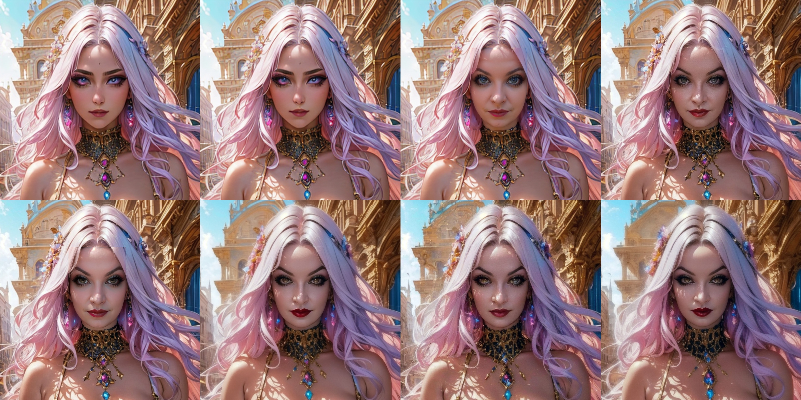

  

custom workflow for Stable Diffusion via SDWEBUIAPI.

Makes multiple passes using targeted LORA weights and YU_Net to run multiple Image2Image passes to get particular faces.

the "CUSTOM_MODELS" list is where I put multiple LORAs of my real-life wife to get her exact face into the image generation.

shout out to:
https://github.com/butaixianran/Stable-Diffusion-Webui-Civitai-Helper

https://github.com/mix1009/sdwebuiapi

https://github.com/AUTOMATIC1111/stable-diffusion-webui
