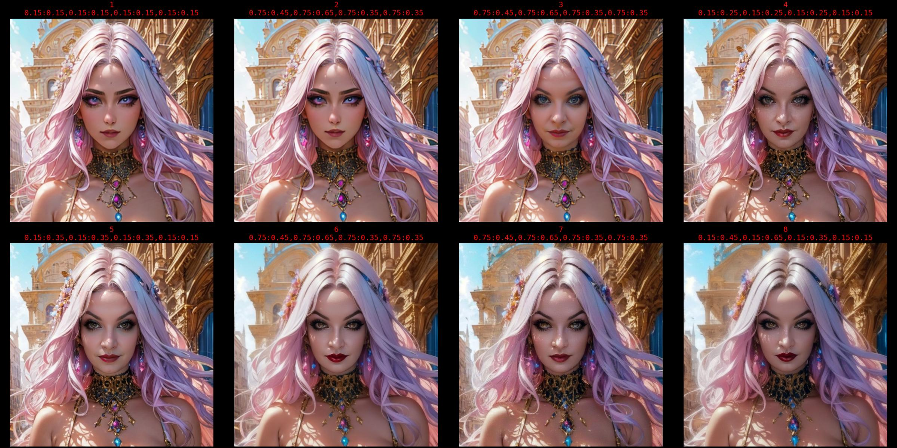
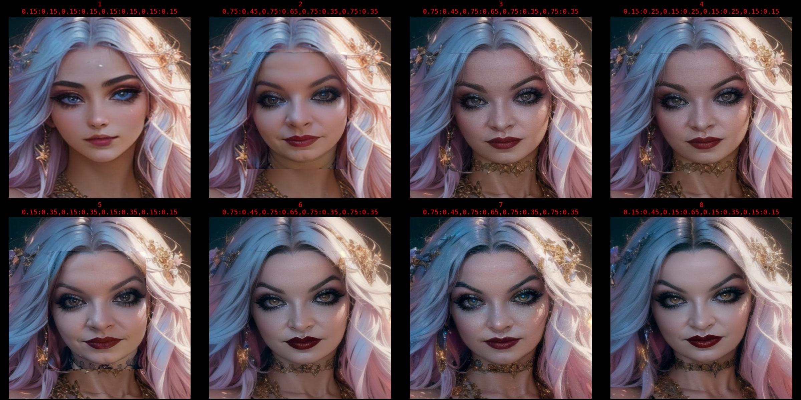
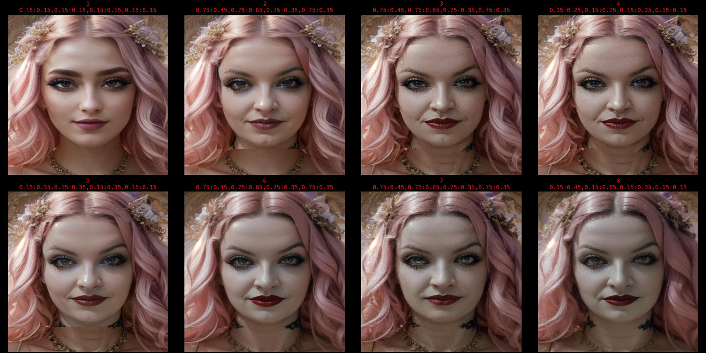

<p align="center">
  
</p>

**This is my custom workflow to inject LORAs based on frequency matching, and does multiple Face Pass iterations by identifying faces, and running mutliple IMAGE2IMAGE passes after designating custom LORA models to insert a particular person into image generations.**

* Can do a straight prompt (No LORA / Tag matching) and run multiple Face Pass itereations
  ```_gen_img_facepass()```
* Can try to match LORA weights to specific Keywords designated through ```kw_search```
  ```_gen_lora_matching()```
* Can run through a folder containing ```.TXT``` files containing tags, ie **1girl, long brown hair, from above, stars, sky, night, moon** and generate images by matching your LORAs to the keywords in the prompt
  ```_gen_folder_lora_matching()```
* The "CUSTOM_MODELS" list is where I put multiple LORAs of my real-life wife to get her exact face into the image generation.
  ```python
      sd.CUSTOM_MODELS = [
      "SUBJECT_FACE_LORA1",
      "SUBJECT_FACE_LORA2",
      "SUBJECT_FACE_LORA3",
      "SUBJECT_FACE_LORA14"]```
* Uses a weight sequence for the Face Pass generation:
  ```python
      sd.weight_seq = [
      ["0.15:0.15", "0.15:0.15", "0.15:0.15", "0.15:0.15"],
      ["0.75:0.45", "0.75:0.65", "0.75:0.35", "0.75:0.35"],  # face
      ["0.75:0.45", "0.75:0.65", "0.75:0.35", "0.75:0.35"],  # face
      ["0.15:0.25", "0.15:0.25", "0.15:0.25", "0.15:0.15"],
      ["0.15:0.35", "0.15:0.35", "0.15:0.35", "0.15:0.15"],
      ["0.75:0.45", "0.75:0.65", "0.75:0.35", "0.75:0.35"],  # face
      ["0.75:0.45", "0.75:0.65", "0.75:0.35", "0.75:0.35"],  # face
      ["0.15:0.45", "0.15:0.65", "0.15:0.35", "0.15:0.15"],]
  ```


## How It Works

1. Downloads YU_Net for you from [opencv_zoo](https://github.com/opencv/opencv_zoo/tree/main/models/face_detection_yunet)
2. Indexes all of your current LORA models by loading the model dict, and compiles the Tag Frequencies from LORA training
3. Saves the Tag Frequency dicts to a JSON file in your LORA directory to save reloading (just delete the file to force it to re-initialize the indexing)
4. Builds a list of all unique keywords
5. Creates a dict/list pair of [TAG] : [LIST OF MODELS WITH THAT KEYWORD]
6. Calculates an arbitrary "Weight" for the keyword by n*0.1 ... *WIP/TODO: Sliding Weight Scale for tag frequencies*
7. Matches your LORAs to specified keywords through ```kw_search = "keyword 1, keyword 2, keyword 3"``` if you are utilizing the  ```_gen_lora_matching()``` or ```_gen_folder_lora_matching()``` functions
8. Chooses some of the top LORA matches based on adding the frequency weights to find the LORAs with the highest percentage of all keywords *WIP*
9. Calculates the prompt for a TXT2IMG pass by passing the CUSTOM_MODEL weight sequencing list
10. Runs a TXT2IMG pass with a newly generated prompt with LORAs added
11. Can changes the model to a new model after TXT2IMG *TODO: global model sequencing*
12. Finds faces in the generated image, and runs a Face Pass
13. Face Pass reduces the weight of all LORAs but the CUSTOM_MODELS, and applies the custom weight sequencing to the CUSTOM_MODELS
14. Runs 2 separate IMAGE2IMAGE passes *TODO: cv2.addWeighted / Face Box edge fuzzing / histogram matching*
15. Runs 2 more IMAGE2IMAGE passes on the entire generated image with the new faces added
16. Runs 2 more IMAGE2IMAGE passes
17. Runs 2 final IMAGE2IMAGE passes


## TODO
1. Sliding Weight Scale for tag frequencies
2. global model sequencing ```[model_1, model_2, ... ]```
3. cv2.addWeighted / Face Box edge fuzzing / histogram matching
4. Image Pass -> Face Pass w/ api DDB Tagging


shout out to:

[Stable-Diffusion-Webui-Civitai-Helper](https://github.com/butaixianran/Stable-Diffusion-Webui-Civitai-Helper)

[sdwebuiapi](https://github.com/mix1009/sdwebuiapi)

[stable-diffusion-webui](https://github.com/AUTOMATIC1111/stable-diffusion-webui)


## Image Stacking / Progression Pics:

```python
import cv2
import numpy as np
from matplotlib import pyplot as plt
weight_seq = [
    ["0.15:0.15", "0.15:0.15", "0.15:0.15", "0.15:0.15"],
    ["0.75:0.45", "0.75:0.65", "0.75:0.35", "0.75:0.35"],  # face
    ["0.75:0.45", "0.75:0.65", "0.75:0.35", "0.75:0.35"],  # face
    ["0.15:0.25", "0.15:0.25", "0.15:0.25", "0.15:0.15"],
    ["0.15:0.35", "0.15:0.35", "0.15:0.35", "0.15:0.15"],
    ["0.75:0.45", "0.75:0.65", "0.75:0.35", "0.75:0.35"],  # face
    ["0.75:0.45", "0.75:0.65", "0.75:0.35", "0.75:0.35"],  # face
    ["0.15:0.45", "0.15:0.65", "0.15:0.35", "0.15:0.15"],]
_GET_LIST_ = lambda fp, exts: [fp+f for f in os.listdir(fp[:-1:]) if os.path.isfile(fp+f) and str(f[-(f[::-1].find('.')):]).lower() in exts]
fp = 'E:/pic_prog/faces/'
imglist = sorted([ imf for imf in _GET_LIST_(fp,['jpg'])[::1] if str(imf).find('stacked')==-1],key=lambda x:x,reverse=False)
imgs = [np.uint8(cv2.imread(im,cv2.IMREAD_COLOR)) for im in imglist]
avg_h,avg_w = (int(abs(np.average([im.shape[0] for im in imgs]))), int(abs(np.average([im.shape[1] for im in imgs]))))
avg = max(avg_h,avg_w)
imgs = [cv2.resize(im,(avg,avg),interpolation=cv2.INTER_AREA) for im in imgs]
imgstack_v = np.vstack([[np.hstack([[im for im in im_arr] for im_arr in [np.array_split(imgs,2)]])]])
s_img = str(f'{fp}stacked.jpg')
cv2.imwrite(s_img,imgstack_v)
params = {"font.size":"12.0","font.family":"monospace","figure.constrained_layout.use": True,"text.color" : "r","figure.facecolor":"k",'figure.figsize':"8,4"}
plt.rcParams.update(params)
_, axs = plt.subplots(len(imgs)//4,len(imgs)//2,figsize=(24,12))
axs = axs.flatten()
for img, ax, i in zip(imgs, axs, range(len(imgs))):
    ax.set_axis_off()
    ax.set_title(f'{i+1}{chr(10)}{chr(44).join(w for w in weight_seq[i])}')
    ax.imshow(img[:,:,::-1])
plt.savefig(s_img)
```
<p align="center">
  
</p>
<p align="center">
  
</p>
